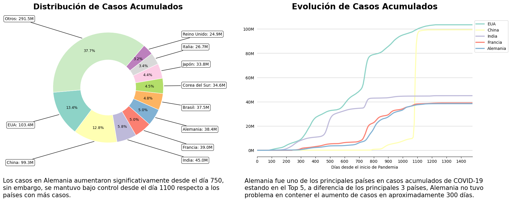
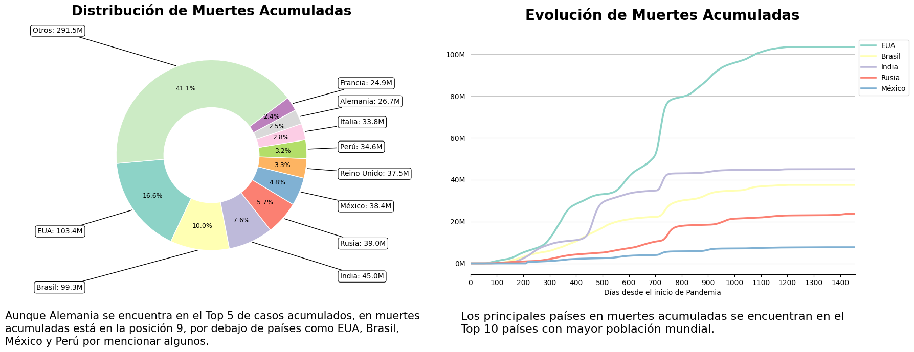
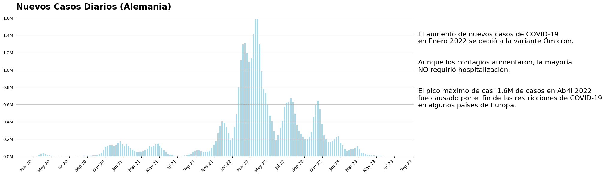

# Análisis de COVID-19 en Alemania

Autor: Gerardo de la Cruz C.

***Autor: Gerardo de la Cruz C.***

Una entidad gubernamental responsable de la gestión de la salud en un país enfrenta el desafío de comprender y analizar la propagación del COVID-19 para tomar decisiones informadas y eficaces en la gestión de la pandemia. Como Científico de Datos, la tarea es analizar los datos relacionados con el COVID-19 y presentar insights a través de visualizaciones que respondan a las siguientes preguntas claves:

### **Preguntas**

**1. ¿Cómo ha evolucionado el COVID-19 en Alemania en comparación con el impacto observado a nivel mundial?**

**2. ¿Cuál ha sido la evolución de los nuevos casos diarios reportados de COVID-19 en Alemania a lo largo del tiempo?**

**3. ¿Cuál es la evolución del índice de letalidad del COVID-19 en el país, comparado con los países con los índices históricos más elevados?**

**4. Desde una perspectiva demográfica, ¿cuáles son las características que tienen un mayor impacto en el índice de letalidad en un país?**

**5. ¿Existe otro insight para proporcionar?**

## Resultados

Después de una limpieza de datos, los resultados que se obtuvieron fueron los siguientes:

### Visualización y Balanceo de Clases
Una vez preprocesados los datos, se realizaron los siguientes gráficos de algunas características que parecieron relevantes del Dataframe.

Es importante mencionar que fue necesario hacer un balanceo de las clases para obtener mejores resultados.

### Mapa de Calor
El siguiente mapa de correlación nos indica que tan relacionadas están las variables unas con otras. Cabe mencionar que se descartaron algunas variables no tan importantes del conjunto de datos original, esto con la finalidad de lograr un mejor modelo.

###               Matrices de Confusión

Se probaron diferentes modelos de Machine Learning, los cuales se pueden observar los resultados de estos a continuación.

### Comparación de Modelos

Parece ser que los modelos con mejores métricas resultan ser Random Forest Classifier y KNN.

## Conclusiones

#### En este proyecto de machine learning el modelo con las mejores métricas fue Random Forest Classifier, obteniendo un Accuracy: 0.846 y Precisión: 0.807. El cual lo hace el modelo con mejores métricas para este proyecto de clasificación de potenciales buenos y malos clientes. Como se observa en la matriz de confusión, RFC es el modelo que menos se equivoca en general al clasificar a los clientes.
