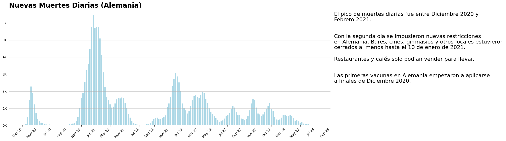
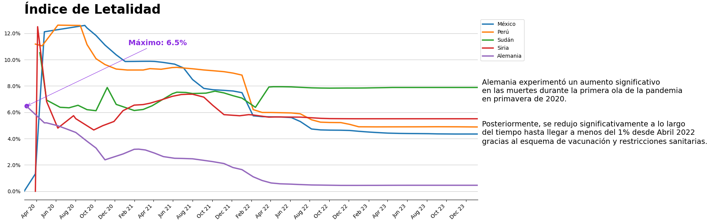
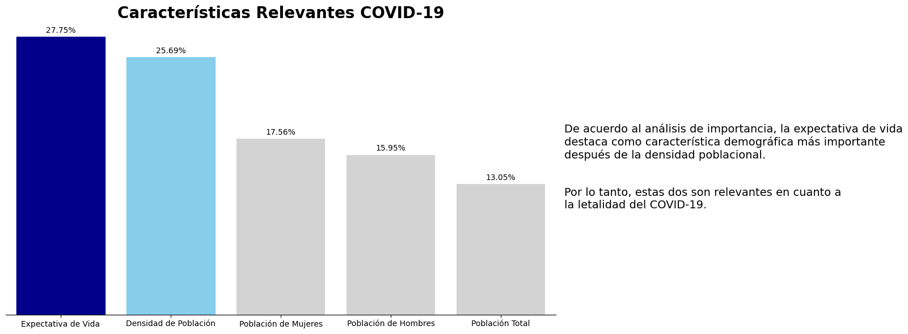
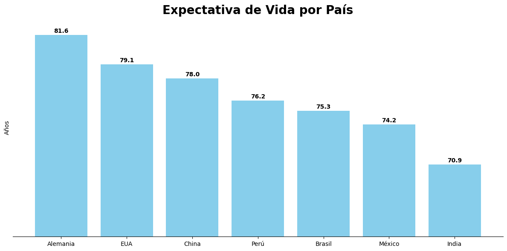
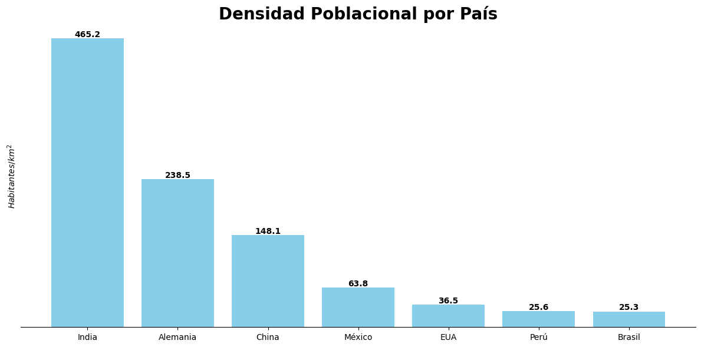

# Análisis de COVID-19 en Alemania

***Autor: Gerardo de la Cruz C.***

Una entidad gubernamental responsable de la gestión de la salud en un país enfrenta el desafío de comprender y analizar la propagación del COVID-19 para tomar decisiones informadas y eficaces en la gestión de la pandemia. Como Científico de Datos, la tarea es analizar los datos relacionados con el COVID-19 y presentar insights a través de visualizaciones que respondan a las siguientes preguntas claves:

### **Preguntas**

**1. ¿Cómo ha evolucionado el COVID-19 en Alemania en comparación con el impacto observado a nivel mundial?**

**2. ¿Cuál ha sido la evolución de los nuevos casos diarios reportados de COVID-19 en Alemania a lo largo del tiempo?**

**3. ¿Cuál es la evolución del índice de letalidad del COVID-19 en el país, comparado con los países con los índices históricos más elevados?**

**4. Desde una perspectiva demográfica, ¿cuáles son las características que tienen un mayor impacto en el índice de letalidad en un país?**

**5. ¿Existe otro insight para proporcionar?**

## Resultados

Después de una limpieza de datos, los resultados que se obtuvieron fueron los siguientes:

Alemania ocupa el lugar 34 en Expectativa de Vida por país, dejándolo bien parado durante la pandemia respecto a otros países y considerando que fue la característica de mayor relevancia en cuanto al Índice de Letalidad.

En cuanto a la densidad poblacional, Alemania ocupa el lugar 55 a nivel mundiaL, lo que coincide con que sea uno de los principales países con mas casos diarios de COVID-19.

## Conclusiones

**1.- Alemania ha reportado hasta ahora un total de 38.4M casos de COVID-19, de los cuales, sólo se registran 175k muertes, lo cual equivale a un 0.45% de muertes totales respecto a los casos totales.**

**2.- El 76% de los alemanes están vacunados con al menos las primeras dosis, lo cual corresponde al importante decenso del índice de letalidad después de la aplicación de la primera dosis (23 de Diciembre del 2020).**

**3.- Podemos decir que Alemania fue uno de los países que mejor salió adelante en la pandemia.**
